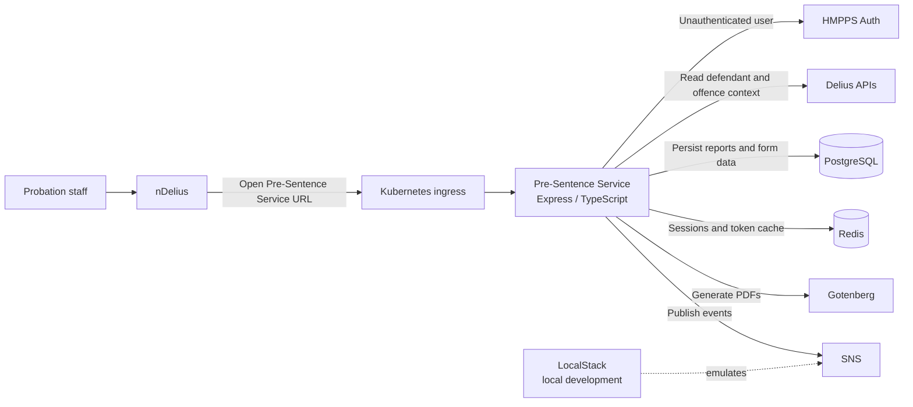

# Architecture Overview

Pre-Sentence Service is an Express and TypeScript application that captures,
stores, and generates pre-sentence reports. It runs in Kubernetes and integrates
with HMPPS platform services and supporting infrastructure.

## System overview

## Main components

| Component | Purpose | Source or configuration |
|---|---|---|
| Express application | Web routes, controllers, middleware, views, and services | [server/app.ts](../server/app.ts), [server/](../server/) |
| PostgreSQL | Stores reports, report details, form values, and related data | [server/repositories/](../server/repositories/), [db/migrations/](../db/migrations/) |
| Redis | Stores web sessions and cached authentication tokens | [server/data/redisClient.ts](../server/data/redisClient.ts) |
| HMPPS Auth | Authenticates users and provides service-to-service authentication | [server/authentication/](../server/authentication/), [server/data/hmppsAuthClient.ts](../server/data/hmppsAuthClient.ts) |
| Delius APIs | Provides defendant, offence, and user access information | [server/services/preSentenceToDeliusService.ts](../server/services/preSentenceToDeliusService.ts), [server/data/](../server/data/) |
| Gotenberg | Converts generated report content to PDF | [server/data/gotenbergClient.ts](../server/data/gotenbergClient.ts), [server/services/pdfGenerationService.ts](../server/services/pdfGenerationService.ts) |
| SNS | Publishes application events | [server/services/eventService.ts](../server/services/eventService.ts), [localstack/](../localstack/) |
| Kubernetes | Runs and configures the application in deployed environments | [helm_deploy/](../helm_deploy/) |

## Runtime flow

1. A probation staff member selects the Pre-Sentence Service link from nDelius.
2. The request reaches the Kubernetes ingress and is routed to the application.
3. If the user is not already authenticated, the application redirects them to HMPPS Auth.
4. After successful authentication, HMPPS Auth redirects the user back to Pre-Sentence Service.
5. The application retrieves the relevant defendant and offence context from Delius APIs.
6. Report data is stored in PostgreSQL, with sessions and token cache data held in Redis.
7. Reports can be rendered as PDFs through Gotenberg.
8. When a report is submitted, the service publishes a versioned event to SNS for downstream consumers. The event links to the generated PDF when available. Otherwise, it links to the report API endpoint.

In local development, LocalStack provides the SNS-compatible AWS service.
