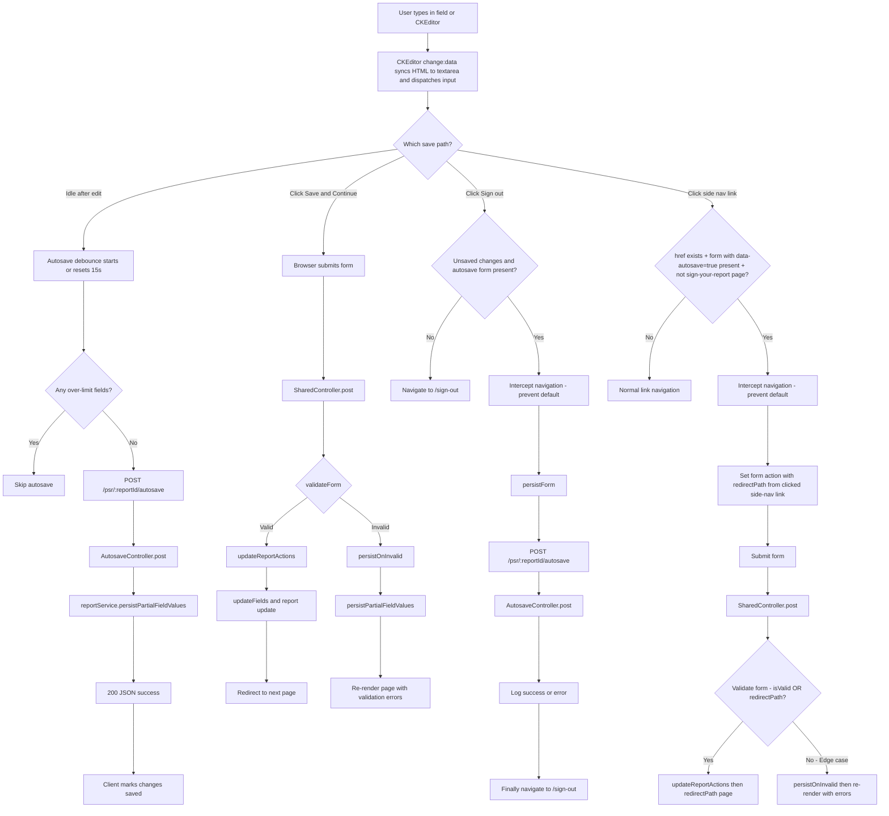

# Save Flows

```mermaid
flowchart TD
  U[User types in field or CKEditor] --> C[CKEditor change:data syncs HTML to textarea and dispatches input]
  C --> P{Which save path?}

  P -->|Idle after edit| A1[Autosave debounce starts or resets 15s]
  A1 --> A2{Any over-limit fields?}
  A2 -->|Yes| A3[Skip autosave]
  A2 -->|No| A4[POST /psr/:reportId/autosave]
  A4 --> A5[AutosaveController.post]
  A5 --> A6[reportService.persistPartialFieldValues]
  A6 --> A7[200 JSON success]
  A7 --> A8[Client marks changes saved]

  P -->|Click Save and Continue| S1[Browser submits form]
  S1 --> S2[SharedController.post]
  S2 --> S3{validateForm}
  S3 -->|Valid| S4[updateReportActions]
  S4 --> S5[updateFields and report update]
  S5 --> S6[Redirect to next page]
  S3 -->|Invalid| S7[persistOnInvalid]
  S7 --> S8[persistPartialFieldValues]
  S8 --> S9[Re-render page with validation errors]

  P -->|Click Sign out| L1{Unsaved changes and autosave form present?}
  L1 -->|No| L2[Navigate to /sign-out]
  L1 -->|Yes| L3[Intercept navigation - prevent default]
  L3 --> L4[persistForm]
  L4 --> L5[POST /psr/:reportId/autosave]
  L5 --> L6[AutosaveController.post]
  L6 --> L7[Log success or error]
  L7 --> L8[Finally navigate to /sign-out]

  P -->|Click side nav link| N1{href exists + form with data-autosave=true present + not sign-your-report page?}
  N1 -->|No| N2[Normal link navigation]
  N1 -->|Yes| N3[Intercept navigation - prevent default]
  N3 --> N4[Set form action with redirectPath from clicked side-nav link]
  N4 --> N5[Submit form]
  N5 --> N6[SharedController.post]
  N6 --> N7{Validate form - isValid OR redirectPath?}
  N7 -->|Yes| N8[updateReportActions then redirectPath page]
  N7 -->|No - Edge case| N9[persistOnInvalid then re-render with errors]
```
