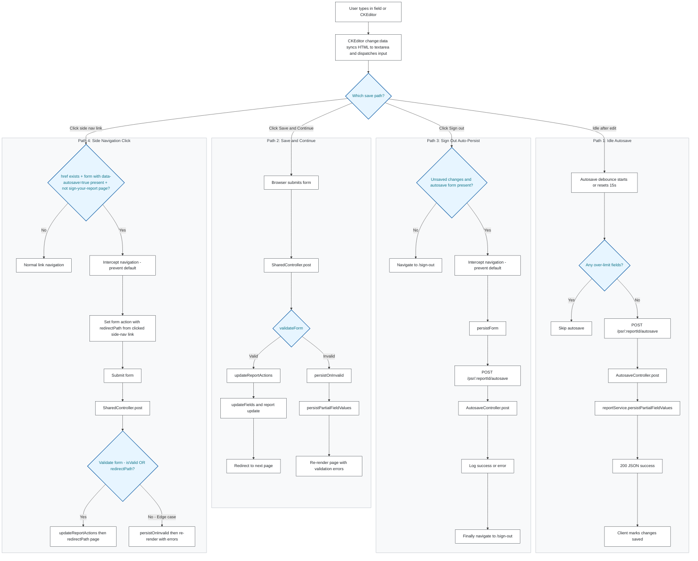

# Save Flows

## Save Flow Operations

This guide covers how to verify and troubleshoot report saving in a running environment.

### Expected behaviour

- Edited fields are autosaved after approximately 15 seconds of inactivity.
- Fields over their character limit are not autosaved until corrected.
- Save and Continue validates the form before moving to the next page.
- Invalid forms retain their partial values and display validation errors.
- Signing out persists pending changes before navigating to the sign-out page.
- Side-navigation links submit pending changes before navigating to another report page.

---

